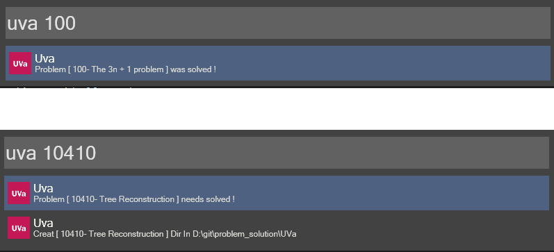

wox_uva
======
My uva [wox](http://www.getwox.com/) plugin  

## Prerequisites
---
Depend on [UvaTools](https://github.com/sd12582000/UvaTools)

## Installing
---
1. Download the [Plugin](https://github.com/sd12582000/wox_uva/releases)
2. Edit `config.json`
3. copy the plugin to `<WoxDirectory>\Plugins\<YourPluginDirectory>`
4. restart the Wox
## Configuration
---
Edit the `config.json` file
```
{"userName":"Your UVa username","rootPath":"root\\UVa Problems dir"}
```
